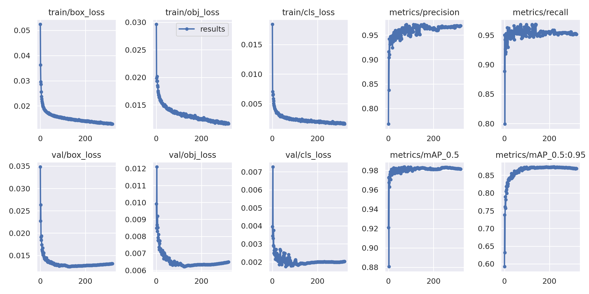
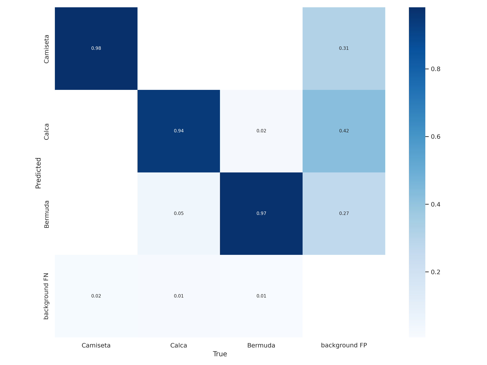
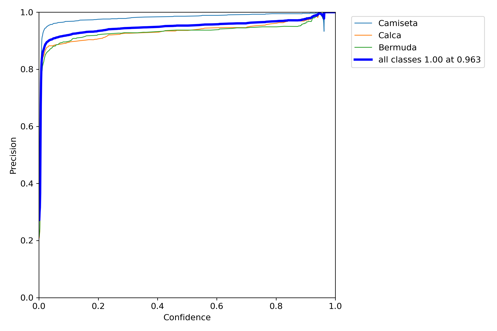
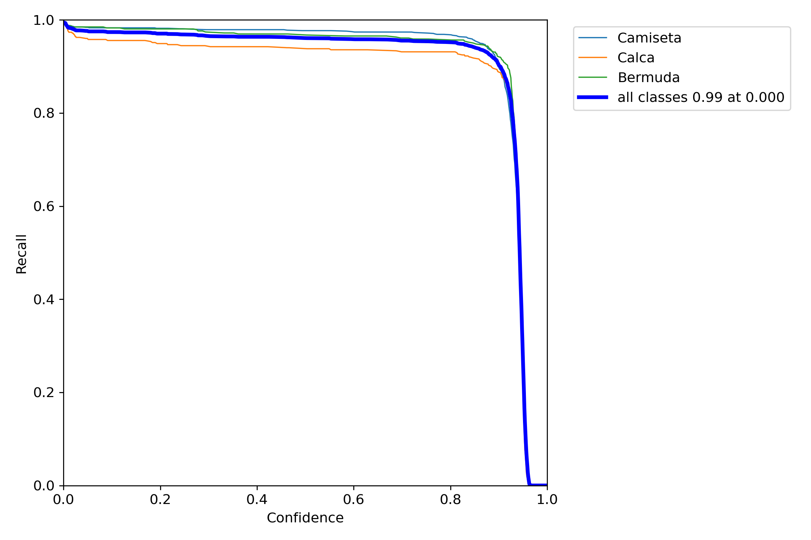
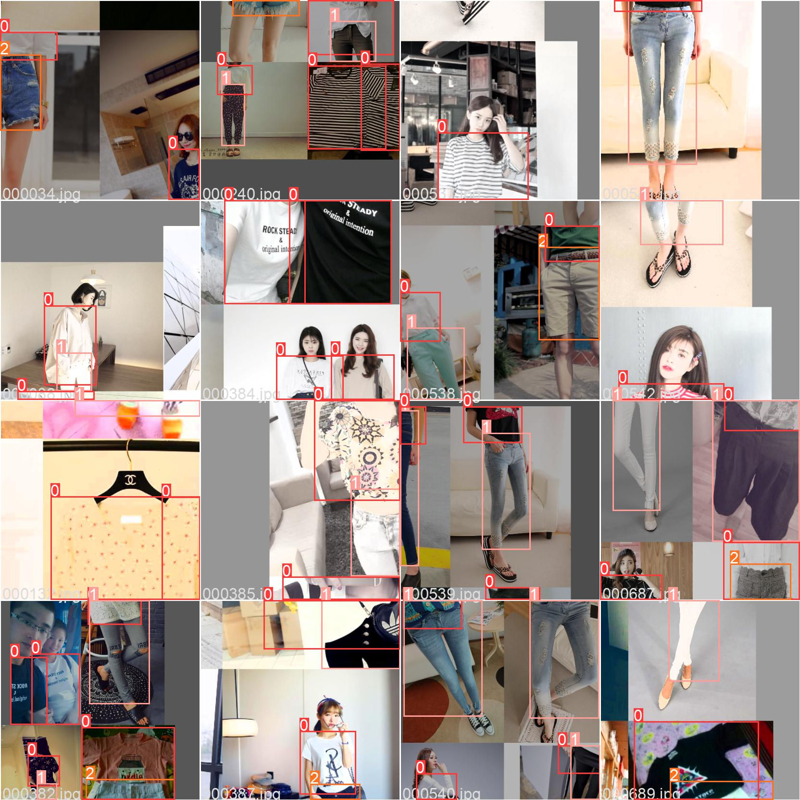
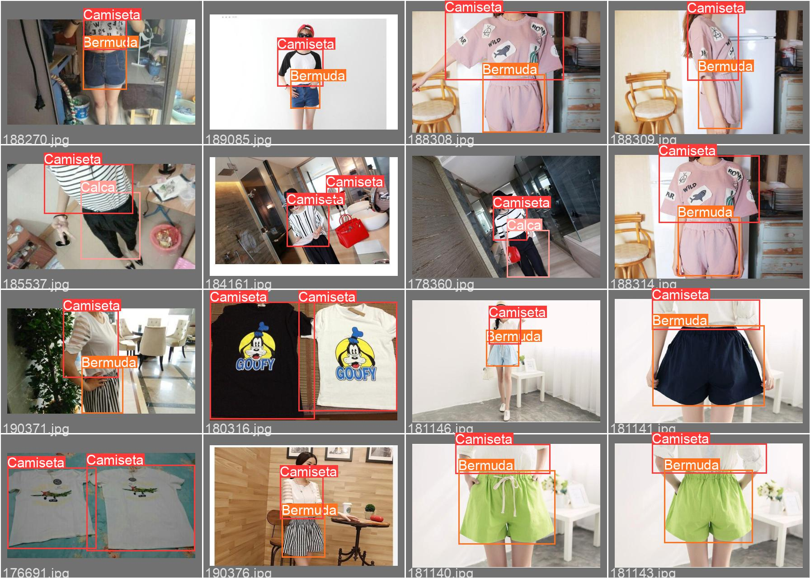

# YoloV5 Cloth Detector

- Paulo Belo Kaari Fernandes Ra: 16.00962-2
- Gabriel euzébio Dicieri Ra: 17.01096-9
- Caio Petrelli Cominato  Ra: 17.00100-5

YoloV5 Cloth Detector é um detector de peças de roupa.

# Sobre o Projeto

Este projeto é um modelo YoloV5 treinado através do dataset DeepFashion2, foi utilizada a linguagem Python para o desenvolvimento do projeto.

- [Melhor weight do treino](https://drive.google.com/file/d/1IulA6-azYlCljpJqPiecOAeWFybjcXZP/view?usp=sharing)
- [Dataset utilizado](https://github.com/switchablenorms/DeepFashion2)

# Resultados

## Visão Geral
 

 
 

## Matriz de Confusão
 

    

 
 

## Precisão
 

 
 

## Recall
 

    

 
 

## Train Batch
 

 
 

## Validation Batch
 

 
 